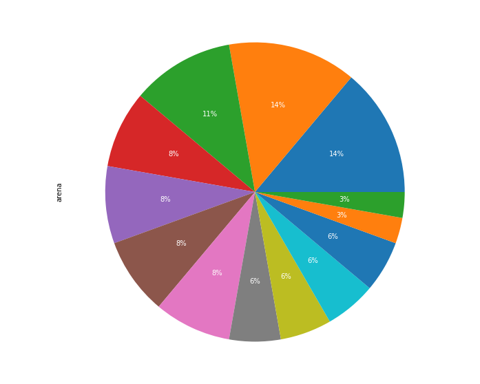
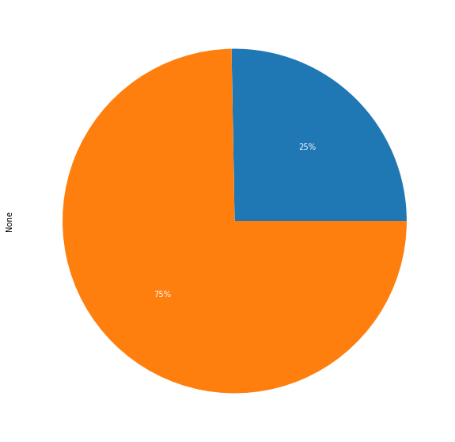
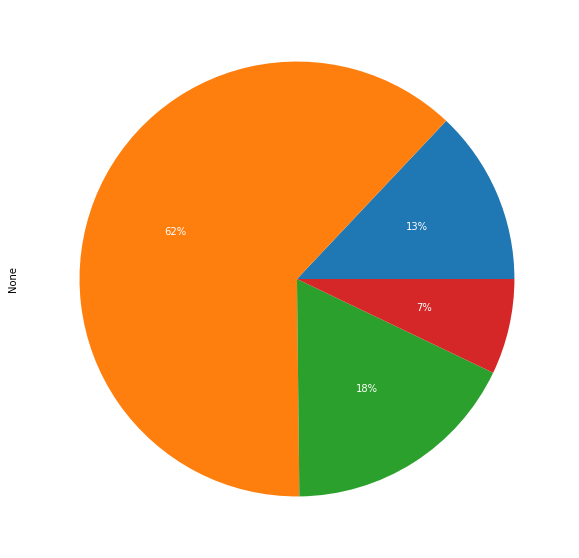

<html>

  <body >

# wtech_bitirme
Merhaba, ben Aylin. SistersLab’in Toplum Gönüllüleri Vakfı (link:https://www.tog.org.tr/en/) tarafından desteklenen Women in Tech Academy proje katılımcılarından
biriyim. Proje, 20–28 yaş aralığındaki 25 kadını 3 ay boyunca yazılım eğitimleriyle güçlendirerek sektörde iş gücüne katılımını hedefliyor. Projeyle ilgili daha fazla
bilgiye bu linkten ulaşabilirsiniz: https://sisterslab.co/women-in-tech-academy/ 

Bu repo da, akademi kapsamında yapılması gereken bitirme projesinin reposudur. 

Bu projede, verilen 5 tane csv dosyasında yer alan veri setlerinden anlamlı analizler çıkarılmıştır. Bu csv dosyaları, NBA ligi ile ilgili detaylı bilgileri içermektedir. Repoda da bu 5 dosyanın okunmuş, sütun isimleri değiştirilmiş, satır ve sütun sayılarına erişilmiştir.
Ardından sırasıyla

* Dosyaları Okuma, sütun adlarını güncelleme, satır-sütun sayılarını bulma 
*  Maçların Nerelerde Oynandığı, Arena Kapasitesinin Ev sahibi takımın galibiyetine etkisi  

*  Takımların kuruluş yıllarının kazanma yüzdeliklerine etkisi
*  Daha Fazla Üçlük Denemenin Galibiyete Etkisi
*  Oyuncuların başlangıç pozisyonlarının, maça katkılarına etkisi
*  Defensive-offensive rebound etkisi
*  En skorer on oyuncunun hücum rebound, savunma reboundı, top çalma ve blok arasında en çok neyi yaptığı
Başlıklarını inceledim
</img>

</img>
</img>
</img>
</img>
</img>
</img>
</img>
  <body>
<html>
