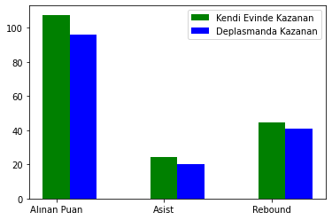
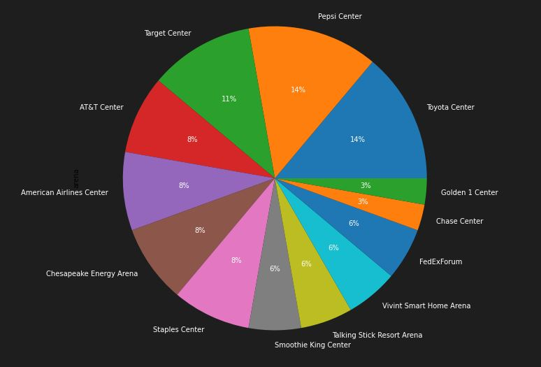
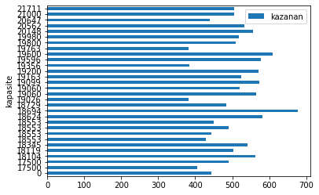
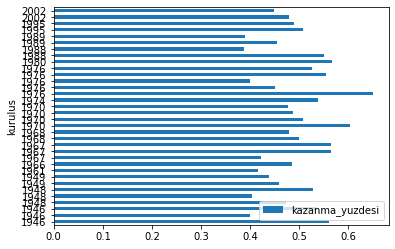
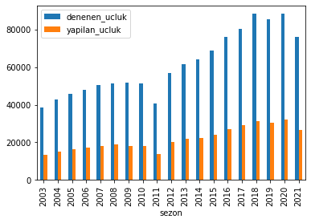
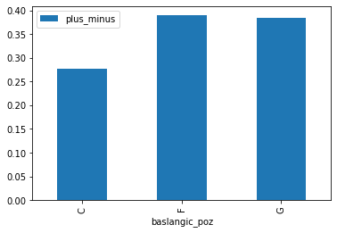

<html>

  <body >

# wtech_bitirme
Merhaba, ben Aylin. SistersLab’in Toplum Gönüllüleri Vakfı (link:https://www.tog.org.tr/en/) tarafından desteklenen Women in Tech Academy proje katılımcılarından
biriyim. Proje, 20–28 yaş aralığındaki 25 kadını 3 ay boyunca yazılım eğitimleriyle güçlendirerek sektörde iş gücüne katılımını hedefliyor. Projeyle ilgili daha fazla
bilgiye bu linkten ulaşabilirsiniz: https://sisterslab.co/women-in-tech-academy/ 

Bu repo da, akademi kapsamında yapılması gereken bitirme projesinin reposudur. 

Bu projede, verilen 5 tane csv dosyasında yer alan veri setlerinden anlamlı analizler çıkarılmıştır. Bu csv dosyaları, NBA ligi ile ilgili detaylı bilgileri içermektedir. Repoda da bu 5 dosyanın sütun isimleri değiştirilmiş, satır ve sütun sayılarına erişilmiştir.
Ardından sırasıyla
* Kazanan takımların kendi evinde/deplasmanda oynamalarının yaptıkları asist rebuond ve aldıkları puana etkisi
</img>

*  Maçların Nerelerde Oynandığı, 
</img>

* Arena Kapasitesinin Ev sahibi takımın galibiyetine etkisi  
</img>

*  Takımların kuruluş yıllarının kazanma yüzdeliklerine etkisi 
</img>

*  Daha Fazla Üçlük Denemenin Galibiyete Etkisi ve Yıllara Göre Takımlar Tarafından Denenen Üçlük Oranı
</img>

* Oyuncuların başlangıç pozisyonlarının, maça katkılarına etkisi
</img>
 
*  Defensive-offensive rebound etkisi
</img>

*  En skorer on oyuncunun hücum rebound, savunma reboundı, top çalma ve blok arasında en çok neyi yaptığı
</img>
Başlıkları incelenmiştir.

  <body>
<html>
